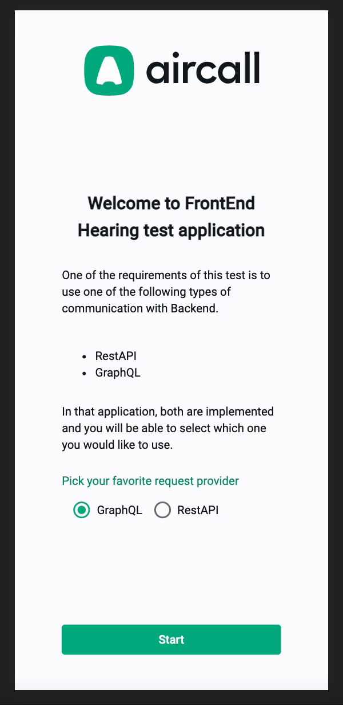
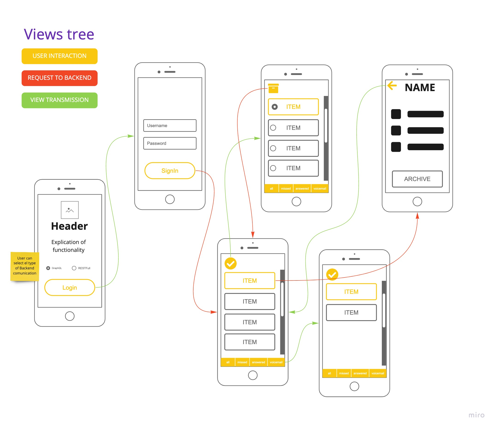

# :phone: FrontendHiringTest :phone:

## Project Arqutecure

The project developed on base of [Angular Framework](https://angular.io/) and requirement specified on [this doc](./exercise-doc.md).

## Demo



## Views application flow



## Startup

In order to start the project in development mode, it is necessary to have the following development environment configured:

- [NodeJS](https://nodejs.org/en/) (at list v.12)
- [Yarn](https://yarnpkg.com/)

Once the environment is configured, the development server can be run

```
yarn start
```
